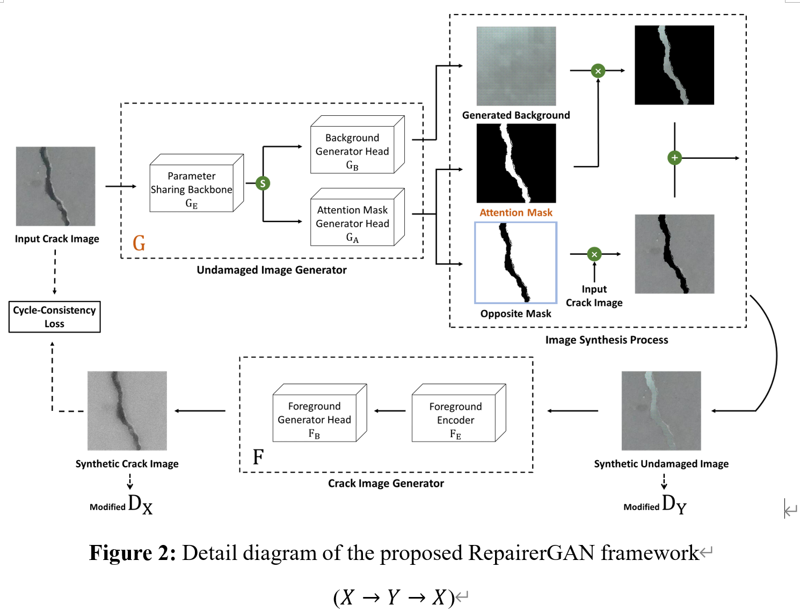
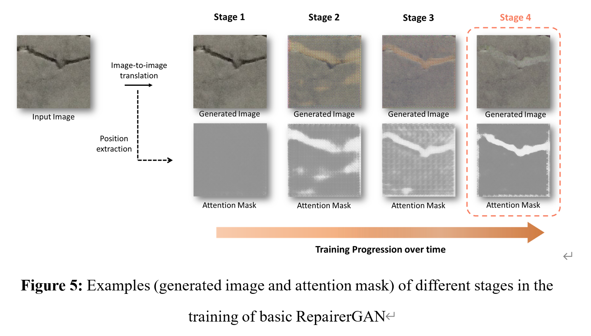
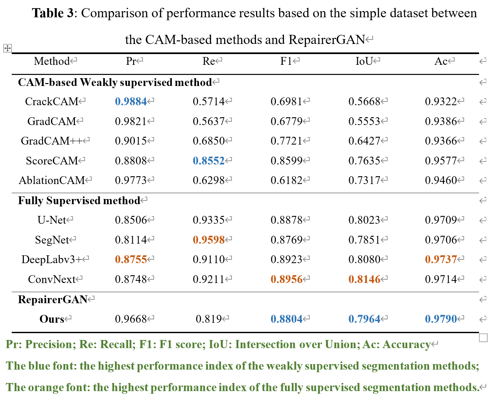
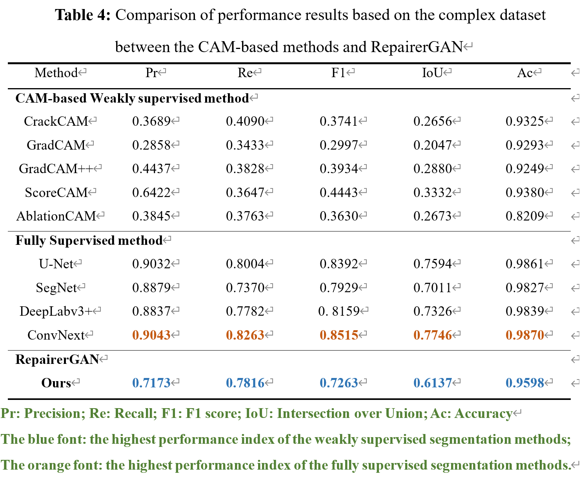

# RepairerGAN

Learning Position Information from Attention: End-to-End Weakly Supervised Crack Segmentation with GANs

Accept (Computers in Industry)<https://www.sciencedirect.com/science/article/abs/pii/S0166361523000714>

If you want to retrain this model, you can get the **Concise one** from <https://github.com/LovingThresh/6_Crack_RepairerGAN>

## Abstract

The current weakly supervised crack segmentation methods with image-level label are mainly based on class activation mapping (CAM) which has the disadvantages of complicated training and poor performance. For the efficient weakly supervised crack segmentation, this paper proposes a novel end-to-end weakly supervised crack segmentation method termed RepairerGAN, which realizes the image-to-image translation and indirectly obtains the crack segmentation result. The proposed RepairerGAN is decoupled into the semantic translation module and position extraction module and uses the attention mechanism to extract the crack position information as the segmentation result. In the simple weakly supervised segmentation task, RepairerGAN only needs a training time equal to 13.3% of that of the best-performing CAM method (ScoreCAM). In the complex task, the performance of RepairerGAN (F1 of 72.63% and IoU of 61.37%) is significantly ahead of ScoreCAM (F1 of 44.43% and IoU of 33.32%).

## Method

## Result

